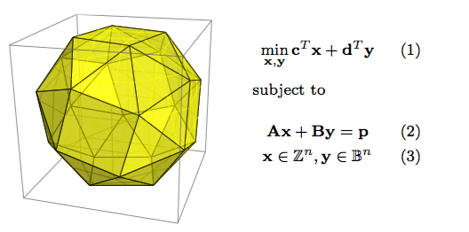

# Kombinatoric optimalization

This course is focusing on the problems and algorithms of combinatorial optimization (often called discrete optimization). Following the courses on linear algebra, graph theory, and basics of optimization, we show optimization techniques based on graphs, integer linear programming, heuristics, approximation algorithms and state space search methods. We focus on application of optimization, e.g. logistics, transportation, planning of human resources, scheduling in production lines, message routing and scheduling in parallel computers.

