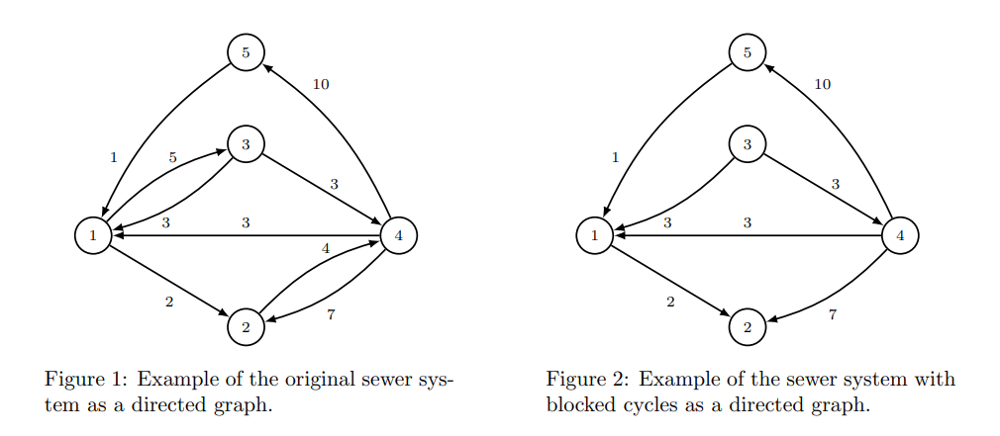
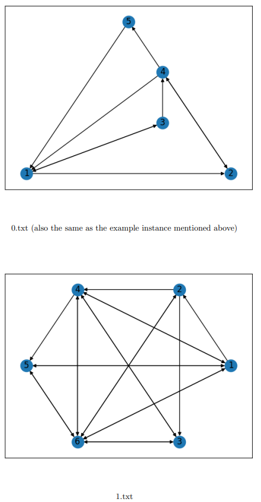
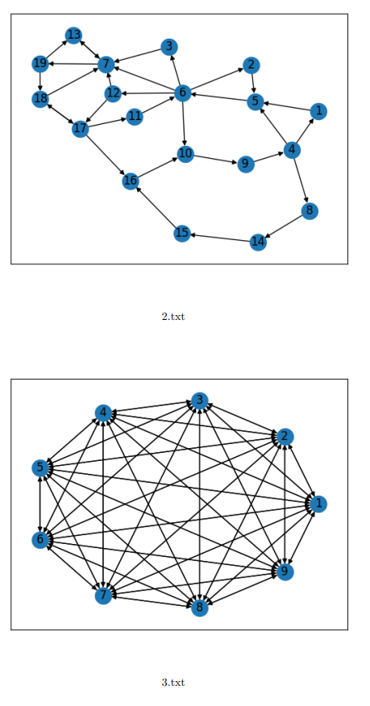

# Semestrální projekt Cocontest: Chytré město s ne příliš chytrou kanalizací

## 1. Motivační příklad

V nejmenovaném městě ve středovýchodní části Evropy byla modernizována kanalizační síť. Aby se zvýšil tok pobídek z Evropského parlamentu, městská rada chtěla, aby se město stalo „chytrým“—každá kanalizační trubka nyní obsahuje různé senzory a kamery. Vše lze monitorovat prostřednictvím webového rozhraní. Zatímco obrovské výhody takových funkcí byly zanedbatelné, celkové náklady na systém byly ve skutečnosti astronomické. Proto byly během realizace vynechány jiné, mnohem méně důležité neesenciální funkce, jako je systém čištění kanalizace.

Když nastal čas na první čištění, skupina „dobrovolníků“ byla vybrána z nedalekého hasičského sboru, aby šli do kanalizace a čistili ji ručním čerpáním vody do trubek. Bohužel pro hasiče byl pro projekt najat prominentní extravagantní architekt Penrose. Jeho díla byla proslulá příliš složitými a velmi často fyzicky nemožnými konstrukcemi. S využitím svého vlastního rozšíření euklidovské geometrie tento neoznačený génius navrhl systém trubek, který popíral i zákony fyziky. Hnán snahou o nemožné zavedl koncept Penrosových schodů do kanalizačního systému. V kanalizačním systému tvořeném trubkami s určitým sklonem se voda mohla skutečně vrátit v cyklu zpět na původní místo, což by bylo jinak nemožné. Ačkoli se tento design na první pohled zdál vizionářský, ukázalo se, že přináší hasičům určité komplikace. Voda—nyní obohacená o obsah kanalizace—se k nim dostávala z jiné trubky. Tím byli chudáci hasiči nemilosrdně smeteni přívalovou vlnou obsahu kanalizace.

Zbylí hasiči nyní odmítají vstoupit do kanalizace, dokud nebudou tyto životu nebezpečné cykly odstraněny. Městský rozpočet je však již přetížen—po celém městě se staví další stejně revoluční projekty. Naštěstí byly nalezeny nákresy kanalizačního designu, které lze analyzovat.

Aby se zablokovala konkrétní trubka v systému (tj. odstranění nějakého řízeného cyklu, ve kterém je trubka přítomna), je potřeba nad trubkou vykopat díru, aby bylo možné vstoupit s potřebným vybavením. To však není stejně nákladné pro každou trubku v systému. Pokud se trubka nachází pod rušnou ulicí nebo budovou, může být mnohem nákladnější tam kopat než kopat nad trubkou umístěnou pod parkem (pokud členové Greenpeace nekladou žádné překážky). Navíc může být trubka součástí více než jednoho cyklu, takže nalezení optimálního způsobu minimalizace všech nákladů na kopání je velmi složitý problém.

## 2. Formální zadání problému

Je vám dáno řízený graf $G = (V, E)$ s množinou vrcholů $V = \{1, 2, \ldots, n\}$ a řízenými hranami $E$. Každá hrana $e \in E$, $e = (i, j)$, je spojena s nákladem $c_e \in \mathbb{Z}^+$. Cílem je najít množinu hran $D$ s minimálním součtem váhy hran, přičemž množina $E \setminus D$ neobsahuje žádné cykly. Výsledný graf nemusí být propojený, ale přemýšlejte o tom, co by to znamenalo pro optimálnost řešení (a chudé obyvatele města používající kanalizační systém k splachování odpadu).

Formální zadání problému lze tedy popsat takto:

$
\min*{D \subseteq E} \sum*{e \in D} c_e
$

za podmínky:

$
(V, E \setminus D) \text{ je acyklický graf.}
$



## 3. Pravidla

Pokud se rozhodnete zvolit tento konkurs jako svůj semestrální projekt, očekává se od vás, že implementujete správný řešitel pro "Chytré město s ne příliš chytrou kanalizací." Implementace bude odeslána na BRUTE (https://cw.felk.cvut.cz/brute/), kde bude automaticky vyhodnocena (počet odeslání není omezen). Hodnocení je kombinací schopnosti najít dobrá řešení a dosaženého pořadí relativně k ostatním studentům (vzhledem k cílové funkci). Proto můžete získat malé množství bodů, i když váš řešitel není ve srovnání s ostatními studenty velmi efektivní.

Na BRUTE najdete 3 úkoly související s konkursem. Každý úkol má specifické instance, pravidla a hodnocení. Konkurs je rozdělen do různých úkolů, aby se zabránilo opětovnému vyhodnocování instancí (což je časově náročné) a aby bylo možné implementovat specifického řešitele pro každý úkol.

1. **SP CC O**: Musíte implementovat přesný MILP řešitel pro problém. Pokud váš řešitel optimálně vyřeší všechny instance v tomto úkolu, získáte za tento úkol 3 body. Pokud řešitel vrátí suboptimální řešení pro jakoukoli instanci v tomto úkolu, vyhodnocení vašeho řešitele je zastaveno a získáte 0 bodů za tento úkol.

2. **SP CC T**: Cílem je najít nejlepší možné proveditelné řešení v rámci stanoveného časového limitu, tj. optimální řešení nejsou vyžadována, a jste povzbuzováni k implementaci chytrých heuristik řešících tyto instance. Pro každou instanci v tomto úkolu získáte nějakou část bodu, pokud náklady vašeho řešení nejsou horší než náš práh (maximálně 4 body).

3. **SP CC R**: Podobně jako v SP CC T, v tomto úkolu se také zajímáme o nalezení nejlepšího možného proveditelného řešení v rámci stanoveného časového limitu. Hodnocení vašeho řešitele však bude záviset na tom, jak dobrý je váš řešitel ve srovnání s řešiteli ostatních studentů, tj. počet získaných bodů bude záviset na vašem pořadí (maximálně 4 body).

Platí také některá obecná pravidla konkursu:

1. Používání jednorázových specifických řešitelů problémů je zakázáno (tj. MILP řešitel je povolen, ale cizí kód pro řešení "Chytré město s ne příliš chytrou kanalizací" jako problém není). Použití MILP řešitele pro prahovou a hodnotící část úkolu je zakázáno.

2. Každý účastník je povinen napsat svůj vlastní kód. Sdílení nápadů a diskuse o problému jsou však podporovány.

## 4. Formát vstupu a výstupu

V SP CC O bude váš řešitel volán jako:

```
$ ./your-solver PATH_INPUT_FILE PATH_OUTPUT_FILE
```

zatímco v SP CC T a SP CC R zahrnujeme časový limit:

```
$ ./your-solver PATH_INPUT_FILE PATH_OUTPUT_FILE TIME_LIMIT
```

- **PATH_INPUT_FILE** a **PATH_OUTPUT_FILE**: podobně jako v domácích úkolech, tyto parametry představují cestu ke vstupním a výstupním souborům (viz níže pro popis formátů souborů).

- **TIME_LIMIT**: číslo s plovoucí desetinnou čárkou představující časový limit v sekundách, který je dán vašemu řešiteli. Váš řešitel bude po dosažení časového limitu ukončen a

získáte 0 bodů. Výstup vašeho řešitele je tedy považován pouze tehdy, pokud váš program ukončí s kódem stavu 0 před vypršením časového limitu.

Vstupní soubor má následující formu (používáme jednu mezeru jako oddělovač mezi hodnotami na jednom řádku):

```
|E|
i1 j1 c1
...
...
...
i|E| j|E| c|E|
```

Výstupní soubor má následující formát:

```
obj
i1 j1
...
...
i|D| j|D|
```

kde **obj** je celkový náklad všech odstraněných hran a uvedené hrany jsou ze sady **D** odstraněných hran. Můžete předpokládat, že všechna čísla ve vstupním a výstupním souboru jsou celá čísla.

### Příklad 1

Tento příklad odpovídá motivačnímu příkladu.

**Vstup:**

```
9
1 2 2
1 3 5
2 4 4
3 1 3
3 4 3
4 1 3
4 2 7
4 5 10
5 1 1
```

**Výstup:**

```
9
1 3
2 4
```

## 5. Obrázky menších veřejných instancí

Abychom vám dále pomohli vizualizovat problém, jsou vám poskytnuty tyto grafy představující první 4 veřejné instance (bez vah). Pokud mezi dvěma vrcholy existuje obousměrná hrana, šipka je obousměrná. Kvůli přehlednosti jsou váhy v obrázcích vynechány.


